# Enfermedades
>Además de las lesiones cariosas nuestros 
dientes están sujetos a otra gran amenaza que no debe subestimarse si queremos 
gozar de unos dientes sanos: el desgaste dental. El desgaste dental supone la 
pérdida irreversible de tejidos duros en la superficie externa del diente y 
engloba diferentes lesiones que pueden acabar arruinando nuestra dentadura. 
Habitualmente se atribuía esta pérdida a la abrasión y erosión causadas por el 
cepillado, pero actualmente se tienen en cuenta otros factores como las fuerzas 
oclusales. 

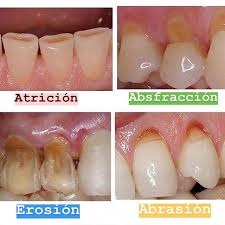

## CARCINOMA DE ENCÍA 
>El cáncer de encia es uno de los tantos tipos de cáncer que 
corresponden a la categoría llamada �cánceres de cabeza y cuellos. El cáncer de 
boca y los otros tipos de cáncer de cabeza y cuello se suelen tratar de manera 
similar.

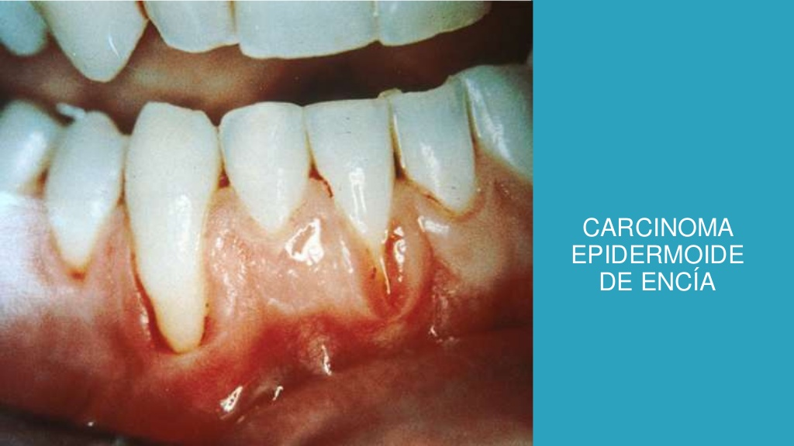

## CARCINOMA DE LENGUA
>El cáncer de lengua es uno de los tantos tipos de cáncer que 
corresponden a la categoría llamada �cánceres de cabeza y cuellos. El cáncer de 
boca y los otros tipos de cáncer de cabeza y cuello se suelen tratar de manera 
similar.

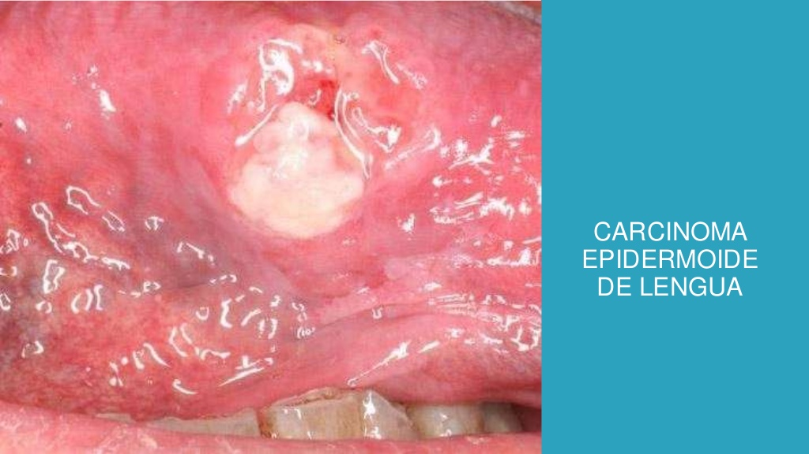

## CARIES DENTAL
>La caries dental es la destrucción de los tejidos de los dientes 
causada por la presencia de ácidos producidos por las bacterias de la placa 
depositada en las superficies dentales. Este deterioro de los dientes está muy 
influenciado por el estilo de vida, es decir influye lo que comemos, la forma 
cómo cuidamos nuestros dientes (nuestros hábitos de higiene), la presencia de 
flúor en la sal y la pasta de dientes que utilizamos. La herencia también juega 
un papel importante en la susceptibilidad de sus dientes a las caries.

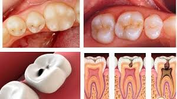

## CONDROMA
>Los tumores cartilaginosos del área buco maxilofacial son raros. Pero 
cuando se presentan es necesario diferenciarlos de otras lesiones de más 
frecuente presentación y del verdadero condrosarcoma. Se presenta un caso de un 
condroma que involucraba la región premaxilar junto el diagnóstico diferencial 
clínico patológico.

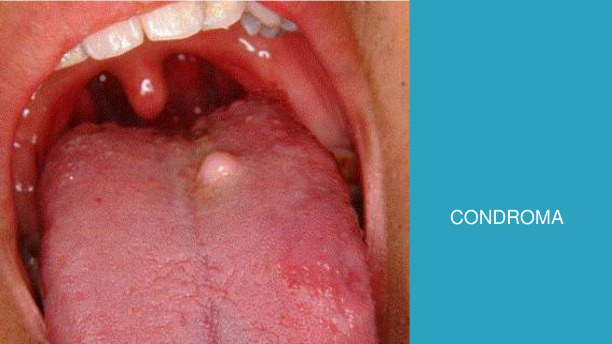

## ENFERMEDAD PERIODONTAL
>Se entiende por enfermedad periodontal la afectación 
patológica de las encías, existiendo fundamentalmente dos tipos: la gingivitis y 
la periodontitis. La primera es un proceso inflamatorio de las encías y la segunda
un agravamiento de este proceso que puede dañar los tejidos blandos y los huesos 
que sostienen los dientes hasta el punto de provocar su caída.

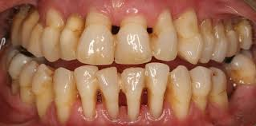

## GINGIVITIS
>La gingivitis se debe a los efectos a corto plazo de los depósitos de 
placa en los dientes. La placa es un material pegajoso compuesto de bacterias, 
moco y residuos de alimentos que se acumula en las partes expuestas de los 
dientes. También es una causa importante de caries dental.

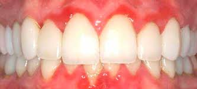

## LEUCOPLAQUIA
>Con la leucoplasia, se forman parches blancos y espesos en las encías,
en la parte interna de los pómulos, en la parte inferior de la boca y, a veces, en
la lengua. Se pueden eliminar los parches raspándolos.

>Los médicos no saben qué causa la leucoplasia, pero consideran que la irritación 
crónica por tabaco, ya sea fumado, humedecido o masticado, es la causa principal 
de su desarrollo.

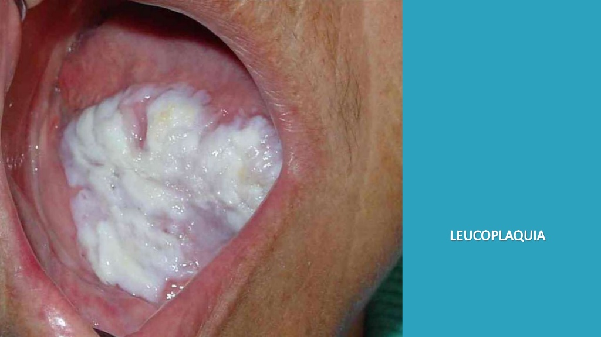

## OSTEOMA
>Un osteoma es un tumor benigno, constituido por tejido óseo maduro y bien
diferenciado, de lento crecimiento, que puede desarrollarse en los huesos de todo
el cuerpo aunque con mayor frecuencia en los huesos de la cara y del cráneo.

>Al ser un tumor benigno no produce metástasis. Puede ser asintomático, causar 
dolor, sinusitis o deformidad ósea.No tiene predilección por edad o sexo.

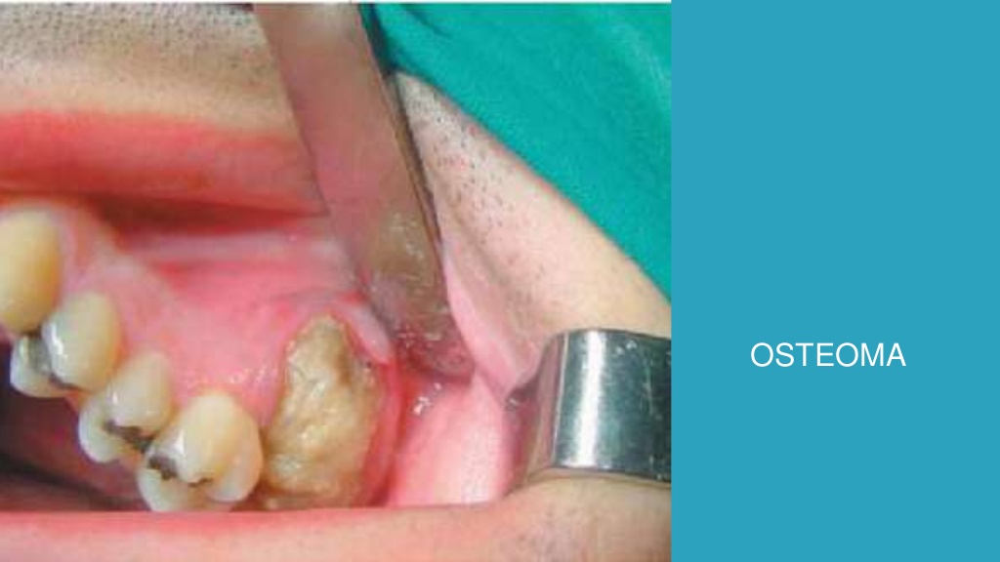

## PAPILOMA 
>El VPH en la boca ocurre debido a la contaminación de la mucosa bucal con
el virus, a través del contacto directo con lesiones infectadas durante la 
realizacián del sexo oral, por ejemplo. Las lesiones del VPH en la boca son mas 
frecuentes en el borde lateral de la lengua, los labios y en el paladar, pero 
cualquier área de la superficie de la cavidad oral puede verse afectada.

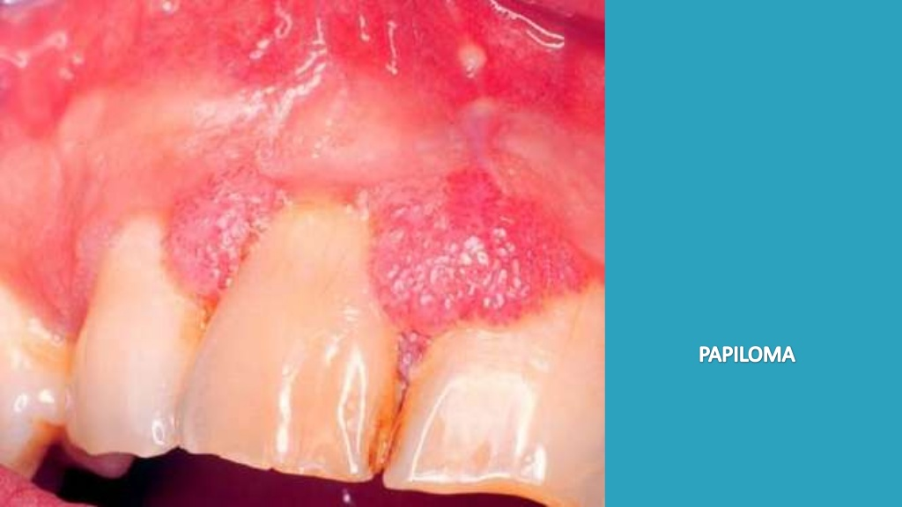

## TORUS
>Los torus son nódulos o protuberancias de diferentes formas configuradas 
por tejido óseo. Suelen crecer en la línea central del paladar (torus palatino) 
o la zona interior de la mandíbula (torus mandibular), concretamente donde se 
ubican los premolares, y lo habitual es que sean bilaterales.

>Los torus carecen de importancia clínica, ya que no su crecimiento es lento y no 
causa síntomas. Tampoco hay riesgo de que se malignicen y raras veces causan 
molestias. No obstante, en ocasiones, especialmente si su tamaño es apreciable, 
pueden causar heridas en la mucosa bucal que resultan algo dolorosas y cicatrizan 
lentamente.

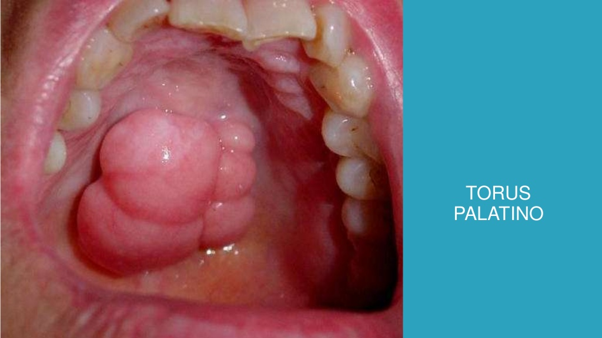

## TUMOR BENIGNO
>Se trata de una serie de entidades que se caracterizan por un 
crecimiento anormal en la boca o lengua con poca probabilidad de extenderse a 
otras partes del cuerpo. Los tumores benignos de la boca o lengua generalmente 
se presentan solos y crecen muy lentamente durante un periodo de 2 a 6 años. 
Pueden aparecer en los labios, encías, paladar, suelo de la boca o lengua.

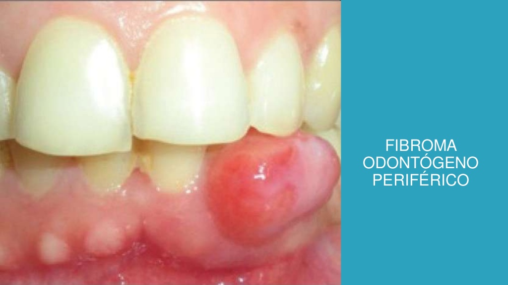

