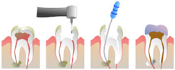

- [ENDONCIA](#endoncia)
- ## ENDONCIA
>Se llama endodoncia, de endo (interior) y odontos (diente), a un tipo 
de tratamiento que se realiza en odontología. Consiste en la extirpación de la 
pulpa dental y el posterior relleno y sellado de la cavidad pulpar con un 
material inerte. Es una especialidad odontolígica reconocida desde 1963 por la 
Asociación Dental Americana mientras que los odontólogos especializados en esta 
técnica reciben el nombre de endodoncistas.

