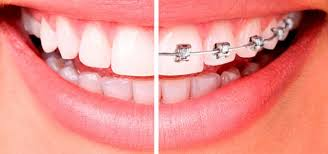

## ORTODONCIA
>La ortodoncia es una especialidad odontológica que estudia, previene y
corrige las alteraciones del desarrollo, las formas de las arcadas dentarias y la 
posición de los maxilares, con el fin de restablecer el equilibrio morfológico y 
funcional de la boca y de la cara, mejorando también la estética facial.

>El objetivo de la ortodoncia es la movilidad de los dientes buscando su 
normalización oclusal (la superficie de masticación), o el desplazamiento de todo 
el conjunto dentario (arco dentario), sobre todo, para corregir trastornos 
funcionales de la masticación. La oclusión se basa en las relaciones de contacto 
que existen entre los dientes de las distintas arcadas (es decir entre los dientes 
superiores y los inferiores).

