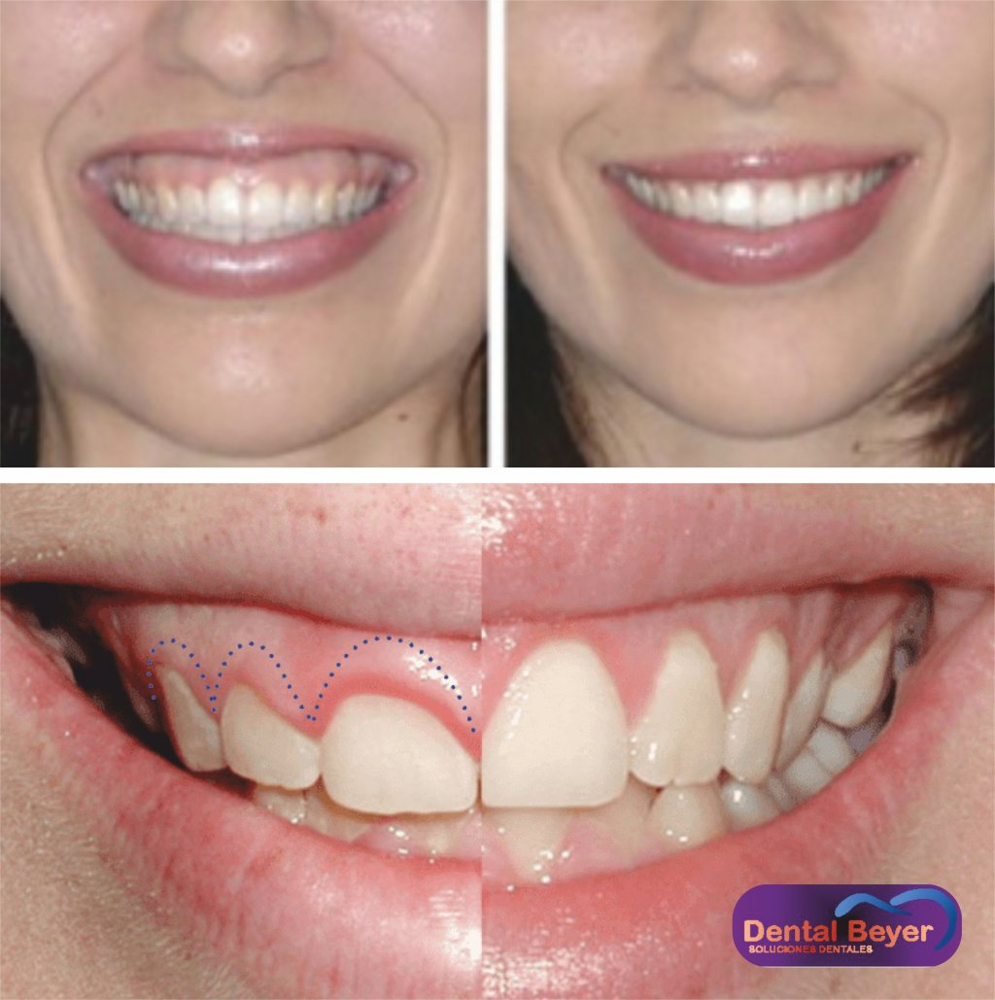
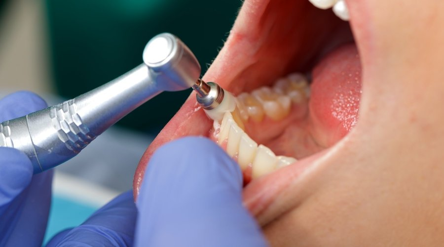
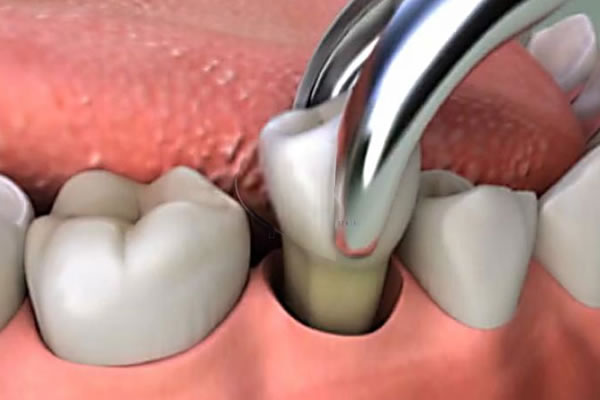
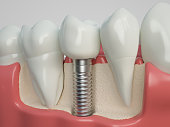

## ALARGAMIENTO DE CORONA
>El alargamiento coronario es una técnica quirúrgica que 
se concreta como el incremento de la longitud de la corona clínica. El término 
de espacio biológico o anchura biológica se define como un espacio tridimensional 
que se extiende desde la cresta del hueso alveolar hasta el surco gingival. 
Anatómicamente, en sentido apicocoronal, esta distancia es de 1,07 mm a la 
inserción del tejido conectivo, 0,97 mm a la unión epitelial y 1 mm de surco 
gingival. Existen variaciones intra e interindividuales que dependen de la edad, 
los dientes y el biotipo periodontal.

## DETARTRAJE DENTAL
>El detartraje dental, puede ser llamado también tartrectomía 
o profilaxis dental. Se trata de una terapia de tipo preventiva, que consiste en 
la eliminación de los depósitos calcificados o tártaro que se acumulan en las 
superficies dentales.  

>Este tratamiento odontológico tiene como principal finalidad la prevención de 
todas aquellas enfermedades las cuales tengan una etiología en el cálculo o 
tártaro, así como las enfermedades gingivales y/o periodontales. 

## EXODONCIA
>La exodoncia es aquella parte de la cirugía 
oral que se ocupa de practicar la avulsión o extracción de un diente o porción del
mismo, mediante unas técnicas e instrumental adecuado, del lecho óseo que lo 
alberga.

>Es el acto quirúrgico mediante el cual se extraen los dientes de sus alveolos con 
el menor trauma posible. Es una cirugía laboriosa que requiere una técnica muy 
cuidadosa, por lo que con frecuencia se producen accidentes y complicaciones 
desde muy simples hasta muy complejas.

## IMPLANTES
>La cirugía de implantes dentales es un procedimiento que reemplaza las 
raíces de los dientes con pernos metálicos que parecen tornillos y reemplaza el 
diente faltante, o dañado, con un diente artificial que tiene el mismo aspecto y 
que cumple la misma función que los dientes reales. La cirugía de implantes 
dentales puede ofrecer una alternativa bien aceptada a las dentaduras o a los 
puentes que no se fijan bien, y puede ofrecer una opción cuando una falta de 
raíces de los dientes naturales no permite la creación de dentaduras o reemplazos 
de dientes con puentes.

