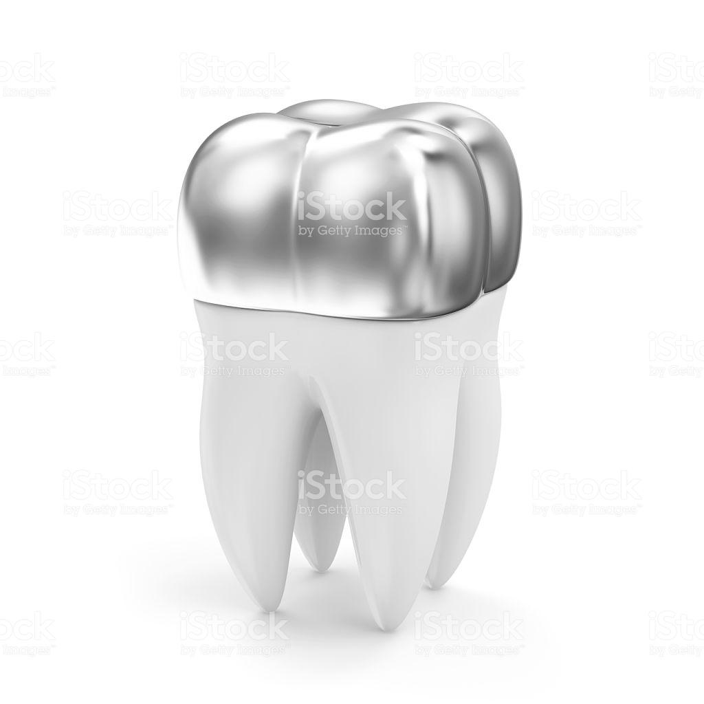
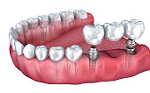

- [BLANQUEAMIENTO](#blanqueamiento)
- [CARILLAS](#carillas)
- [CORONA DE ACERO](#corona-de-acero)
- [CORONA DE ORA](#corona-de-ora)
- [FERULIZACIÓN](#ferulizaci%c3%93n)
- [PPF IMPLANTO SOPORTADA](#ppf-implanto-soportada)
- [PROTESIS PARCIAL FIJA](#protesis-parcial-fija)
- [PROTESIS PARCIAL REMOVIBLE](#protesis-parcial-removible)
- [RECINA Y AMALGAMA](#recina-y-amalgama)

## BLANQUEAMIENTO
>El blanqueamiento dental es un tratamiento de odontología estética 
que tiene por objetivo eliminar las manchas dentales y hacer que la dentición 
adquiera una tonalidad más blanca y brillante. La actual popularidad de la 
estética ha convertido a este procedimiento odontológico en uno de los más 
solicitados de los últimos años.

>Es de especial importancia que los dentistas están capacitados para el manejo de 
los agentes blanqueadores, siguiendo un protocolo adecuado de diagnóstico, 
planificación del procedimiento y mantenimiento de los resultados. Por ello, es 
vital que el profesional conozca a fondo tanto las indicaciones como las 
contraindicaciones de las técnicas de blanqueamiento dental para poder 
transmitírselas a los pacientes.

## CARILLAS
>Las carillas dentales son finas láminas de resina o porcelana que pueden 
ser colocadas por el dentista sobre los dientes para mejorar la armonía de la 
sonrisa, dando como resultado dientes alineados, blancos y bien ajustados, con 
una durabilidad de 10 a 15 años. 

>Estas láminas, además de favorecer la estética, también ayudan a minimizar el 
desgaste de los dientes y acumulan menos placa dental, mejorando la higiene y la 
salud bucal. 

>Las carillas sólo deben ser colocadas por un dentista especializado y no pueden 
repararse si se agrietan o quiebran, siendo necesario sustituir cada lámina 
defectuosa. El precio varía de acuerdo con el tipo de carilla que se utilice, 
siendo las de porcelana más costosas que las de resina. 

## CORONA DE ACERO
>Las coronas de acero inoxidable son del tipo prefabricadas, se 
utilizan en los dientes permanentes, principalmente como una medida temporal, 
para proteger la pieza dental, mientras que una corona permanente se elabora de 
otro material.

>Para los niños una corona de acero inoxidable se utiliza comúnmente para colocarse
en un diente de leche, que ha sido preparado para adaptarse a el. Cuando el diente
primario sale para crear el espacio que luego ocupará el diente permanente, la 
corona se perderá de forma natural cuando sea reemplazado.

>En general, las coronas de acero inoxidable se utilizan para los dientes de los 
niños, ya que no requieren varias visitas al dentista, siendo más rentables que 
las coronas a medida.

## CORONA DE ORA
>Tradicionalmente y durante siglos, el oro ha sido el material preferido 
para efectuar restauraciones en los dientes: fundas, incrustaciones y coronas. El 
oro es un mineral extraordinariamente dúctil y maleable, por lo que resulta fácil 
confeccionar protesis dentales con el, que además tienen grandes propiedades 
químicas (no produce alergias), físicas y mecénicas. Esto se conoce como 
biocompatibilidad: en la boca del paciente, una prótesis de oro se desgasta a un 
ritmo muy similar al esmalte de los dientes naturales del paciente.

>Los dientes de oro son muy duraderos y no se fracturan fácilmente: las coronas o 
fundas de oro aguantan muy bien el paso del tiempo y no es raro que se mantengan 
en perfectas condiciones décadas después de que hayan sido colocadas en la boca 
del paciente.

>Las coronas, fundas o puentes dentales doradas fueron muy populares hace unas 
décadas, y aunque hoy día se realizan muy pocas restauraciones dentales con este 
material, los dientes con coronas de oro no suponen un riesgo para la salud y son 
perfectamente útiles y seguras en los pacientes que ya las tienen.

## FERULIZACIÓN
>La ferulización dental es uno de los procedimientos más antiguos de 
la odontología. La ferulización más antigua encontrada fue una mandíbula humana 
de 500 años a.C. cuyos incisivos habían sido amarrados con una ligadura de hilos de oro.
Este procedimiento consiste en la unión de dos o más dientes con la finalidad de 
aumentar la estabilidad y evitar la movilidad de estos dientes unidos. 

## PPF IMPLANTO SOPORTADA
>Las prótesis sobre implantes son prótesis 
implantosoportadas, es decir, se sujetan en implantes dentales, por lo que el 
paciente debe someterse previamente a una operación quirúrgica. Estás prótesis 
pueden ser fijas (implantosoportadas) o removibles (implantomucosoportadas).

>En el maxilar superior y en la mandíbula, las rehabilitaciones completas con 
implantes dentales se pueden hacer mediante rehabilitaciones implantosoportadas 
(rehabilitación fija) o mediante rehabilitaciones implantomucosoportadas 
(rehabilitaciones removibles o sobredentaduras).

## PROTESIS PARCIAL FIJA
>Son las prótesis dentales que se realizan para suplantar 
piezas dañadas o perdidas, usando como pilares dientes naturales. Son las prótesis 
dentales que están en la boca del paciente de forma fija. Pueden ser para un 
diente (corona) o para varios (puente).
Son trabajos de precisión y totalmente a medida del paciente.

## PROTESIS PARCIAL REMOVIBLE
> Las prótesis removibles son un tratamiento de 
Odontología restauradora que, como su propio nombre indica, se diseñan y fabrican 
de modo que el paciente pueda colocársela y quitársela cuando lo necesite, lo que 
facilita enormemente su higiene. Se utiliza para suplir las ausencias dentales en 
las personas que han perdido uno o más dientes, pero no todos.

## RECINA Y AMALGAMA 
>Es un modo de reparar un diente dañado por caries y devolverle 
su función y forma normal. Cuando el dentista realiza una obturación o 
restauración, primero retira el material cariado, limpia la zona afectada, luego 
rellena la cavidad con un material de restauración.

>Al cerrar espacios donde las bacterias pueden alojarse, la restauración ayuda a 
evitar futuras caries. Los materiales utilizados pueden ser oro, porcelana, resina
composite (restauraciones del mismo color del diente), y amalgama (aleación de 
mercurio, plata, cobre, estaño y a veces zinc).

