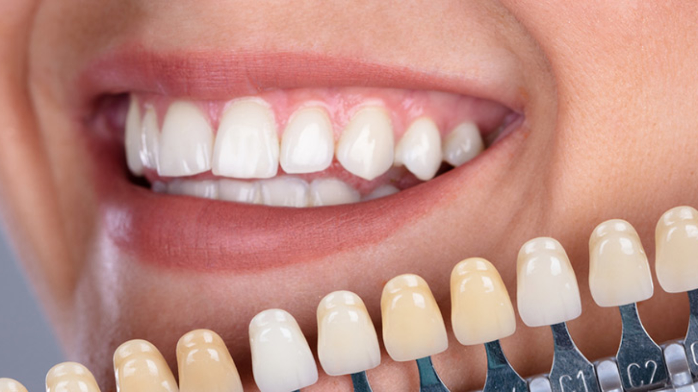
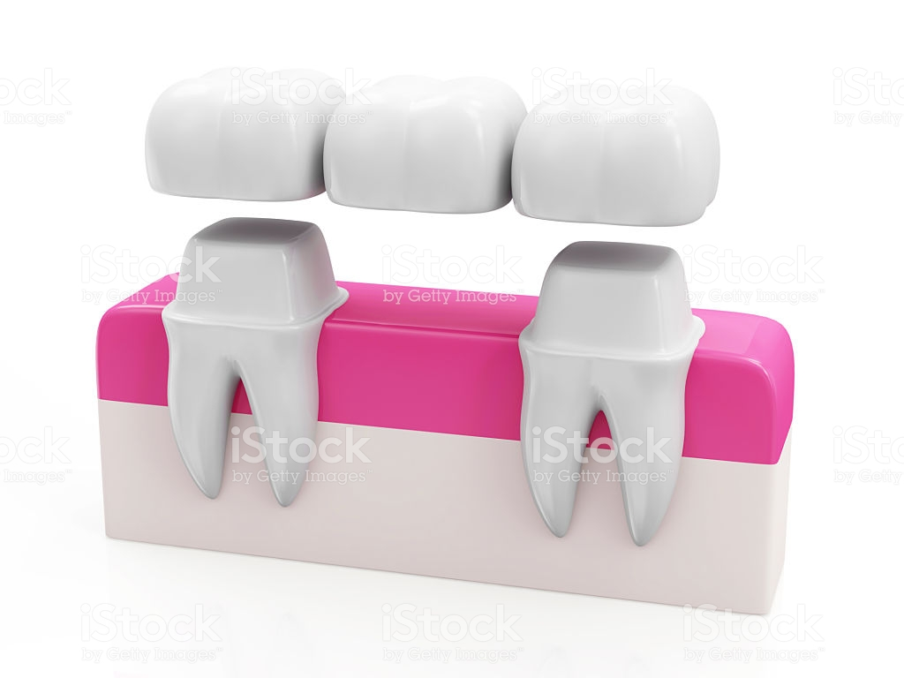

# 
# Endodoncia
>Se llama endodoncia, de endo (interior) y odontos (diente), a un tipo 
de tratamiento que se realiza en odontología. Consiste en la extirpación de la 
pulpa dental y el posterior relleno y sellado de la cavidad pulpar con un 
material inerte. Es una especialidad odontolígica reconocida desde 1963 por la 
Asociación Dental Americana mientras que los odontólogos especializados en esta 
técnica reciben el nombre de endodoncistas.

# Odontopediatria
>Aparotologia:Cuando los niños son más pequeños, todos sus huesos están a medio 
formar y por lo tanto, muchas veces se detecta que los maxilares están colocados 
en una mala posición, y por lo tanto, su mordida es incorrecta. Los aparatos 
removibles consiguen subsanar este defecto. Muchos niños sólo necesitan de un 
aparato removible porque al corregir sus maxilares, se colocan automáticamente 
los dientes en una posición correcta. Sin embargo, hay otros pacientes que 
necesitan dos fases, y algunos, sólo los aparatos fijos (sobre todo cuando los 
niños son más mayores, cerca de la adolescencia).

# Ortodoncia
>La ortodoncia es una especialidad odontológica que estudia, previene y
corrige las alteraciones del desarrollo, las formas de las arcadas dentarias y la 
posición de los maxilares, con el fin de restablecer el equilibrio morfológico y 
funcional de la boca y de la cara, mejorando también la estética facial.

>El objetivo de la ortodoncia es la movilidad de los dientes buscando su 
normalización oclusal (la superficie de masticación), o el desplazamiento de todo 
el conjunto dentario (arco dentario), sobre todo, para corregir trastornos 
funcionales de la masticación. La oclusión se basa en las relaciones de contacto 
que existen entre los dientes de las distintas arcadas (es decir entre los dientes 
superiores y los inferiores).

# Periodoncia  
## ALARGAMIENTO DE CORONA
>El alargamiento coronario es una técnica quirúrgica que 
se concreta como el incremento de la longitud de la corona clínica. El término 
de espacio biológico o anchura biológica se define como un espacio tridimensional 
que se extiende desde la cresta del hueso alveolar hasta el surco gingival. 
Anatómicamente, en sentido apicocoronal, esta distancia es de 1,07 mm a la 
inserción del tejido conectivo, 0,97 mm a la unión epitelial y 1 mm de surco 
gingival. Existen variaciones intra e interindividuales que dependen de la edad, 
los dientes y el biotipo periodontal.

## DETARTRAJE DENTAL
>El detartraje dental, puede ser llamado también tartrectomía 
o profilaxis dental. Se trata de una terapia de tipo preventiva, que consiste en 
la eliminación de los depósitos calcificados o tártaro que se acumulan en las 
superficies dentales.  

>Este tratamiento odontológico tiene como principal finalidad la prevención de 
todas aquellas enfermedades las cuales tengan una etiología en el cálculo o 
tártaro, así como las enfermedades gingivales y/o periodontales. 

## EXODONCIA
>La exodoncia es aquella parte de la cirugía 
oral que se ocupa de practicar la avulsión o extracción de un diente o porción del
mismo, mediante unas técnicas e instrumental adecuado, del lecho óseo que lo 
alberga.

>Es el acto quirúrgico mediante el cual se extraen los dientes de sus alveolos con 
el menor trauma posible. Es una cirugía laboriosa que requiere una técnica muy 
cuidadosa, por lo que con frecuencia se producen accidentes y complicaciones 
desde muy simples hasta muy complejas.

## IMPLANTES
>La cirugía de implantes dentales es un procedimiento que reemplaza las 
raíces de los dientes con pernos metálicos que parecen tornillos y reemplaza el 
diente faltante, o dañado, con un diente artificial que tiene el mismo aspecto y 
que cumple la misma función que los dientes reales. La cirugía de implantes 
dentales puede ofrecer una alternativa bien aceptada a las dentaduras o a los 
puentes que no se fijan bien, y puede ofrecer una opción cuando una falta de 
raíces de los dientes naturales no permite la creación de dentaduras o reemplazos 
de dientes con puentes.

# Reabilitacion
## BLANQUEAMIENTO
>El blanqueamiento dental es un tratamiento de odontología estética 
que tiene por objetivo eliminar las manchas dentales y hacer que la dentición 
adquiera una tonalidad más blanca y brillante. La actual popularidad de la 
estética ha convertido a este procedimiento odontológico en uno de los más 
solicitados de los últimos años.

>Es de especial importancia que los dentistas están capacitados para el manejo de 
los agentes blanqueadores, siguiendo un protocolo adecuado de diagnóstico, 
planificación del procedimiento y mantenimiento de los resultados. Por ello, es 
vital que el profesional conozca a fondo tanto las indicaciones como las 
contraindicaciones de las técnicas de blanqueamiento dental para poder 
transmitírselas a los pacientes.

## CARILLAS
>Las carillas dentales son finas láminas de resina o porcelana que pueden 
ser colocadas por el dentista sobre los dientes para mejorar la armonía de la 
sonrisa, dando como resultado dientes alineados, blancos y bien ajustados, con 
una durabilidad de 10 a 15 años. 

>Estas láminas, además de favorecer la estética, también ayudan a minimizar el 
desgaste de los dientes y acumulan menos placa dental, mejorando la higiene y la 
salud bucal. 

>Las carillas sólo deben ser colocadas por un dentista especializado y no pueden 
repararse si se agrietan o quiebran, siendo necesario sustituir cada lámina 
defectuosa. El precio varía de acuerdo con el tipo de carilla que se utilice, 
siendo las de porcelana más costosas que las de resina. 

## CORONA DE ACERO
>Las coronas de acero inoxidable son del tipo prefabricadas, se 
utilizan en los dientes permanentes, principalmente como una medida temporal, 
para proteger la pieza dental, mientras que una corona permanente se elabora de 
otro material.

>Para los niños una corona de acero inoxidable se utiliza comúnmente para colocarse
en un diente de leche, que ha sido preparado para adaptarse a el. Cuando el diente
primario sale para crear el espacio que luego ocupará el diente permanente, la 
corona se perderá de forma natural cuando sea reemplazado.

>En general, las coronas de acero inoxidable se utilizan para los dientes de los 
niños, ya que no requieren varias visitas al dentista, siendo más rentables que 
las coronas a medida.

## CORONA DE ORA
>Tradicionalmente y durante siglos, el oro ha sido el material preferido 
para efectuar restauraciones en los dientes: fundas, incrustaciones y coronas. El 
oro es un mineral extraordinariamente dúctil y maleable, por lo que resulta fácil 
confeccionar protesis dentales con el, que además tienen grandes propiedades 
químicas (no produce alergias), físicas y mecénicas. Esto se conoce como 
biocompatibilidad: en la boca del paciente, una prótesis de oro se desgasta a un 
ritmo muy similar al esmalte de los dientes naturales del paciente.

>Los dientes de oro son muy duraderos y no se fracturan fácilmente: las coronas o 
fundas de oro aguantan muy bien el paso del tiempo y no es raro que se mantengan 
en perfectas condiciones décadas después de que hayan sido colocadas en la boca 
del paciente.

>Las coronas, fundas o puentes dentales doradas fueron muy populares hace unas 
décadas, y aunque hoy día se realizan muy pocas restauraciones dentales con este 
material, los dientes con coronas de oro no suponen un riesgo para la salud y son 
perfectamente útiles y seguras en los pacientes que ya las tienen.

## FERULIZACIÓN
>La ferulización dental es uno de los procedimientos más antiguos de 
la odontología. La ferulización más antigua encontrada fue una mandíbula humana 
de 500 años a.C. cuyos incisivos habían sido amarrados con una ligadura de hilos de oro.
Este procedimiento consiste en la unión de dos o más dientes con la finalidad de 
aumentar la estabilidad y evitar la movilidad de estos dientes unidos. 

## PPF IMPLANTO SOPORTADA
>Las prótesis sobre implantes son prótesis 
implantosoportadas, es decir, se sujetan en implantes dentales, por lo que el 
paciente debe someterse previamente a una operación quirúrgica. Estás prótesis 
pueden ser fijas (implantosoportadas) o removibles (implantomucosoportadas).

>En el maxilar superior y en la mandíbula, las rehabilitaciones completas con 
implantes dentales se pueden hacer mediante rehabilitaciones implantosoportadas 
(rehabilitación fija) o mediante rehabilitaciones implantomucosoportadas 
(rehabilitaciones removibles o sobredentaduras).

## PROTESIS PARCIAL FIJA
>Son las prótesis dentales que se realizan para suplantar 
piezas dañadas o perdidas, usando como pilares dientes naturales. Son las prótesis 
dentales que están en la boca del paciente de forma fija. Pueden ser para un 
diente (corona) o para varios (puente).
Son trabajos de precisión y totalmente a medida del paciente.

## PROTESIS PARCIAL REMOVIBLE
> Las prótesis removibles son un tratamiento de 
Odontología restauradora que, como su propio nombre indica, se diseñan y fabrican 
de modo que el paciente pueda colocársela y quitársela cuando lo necesite, lo que 
facilita enormemente su higiene. Se utiliza para suplir las ausencias dentales en 
las personas que han perdido uno o más dientes, pero no todos.

## RECINA Y AMALGAMA 
>Es un modo de reparar un diente dañado por caries y devolverle 
su función y forma normal. Cuando el dentista realiza una obturación o 
restauración, primero retira el material cariado, limpia la zona afectada, luego 
rellena la cavidad con un material de restauración.

>Al cerrar espacios donde las bacterias pueden alojarse, la restauración ayuda a 
evitar futuras caries. Los materiales utilizados pueden ser oro, porcelana, resina
composite (restauraciones del mismo color del diente), y amalgama (aleación de 
mercurio, plata, cobre, estaño y a veces zinc).

